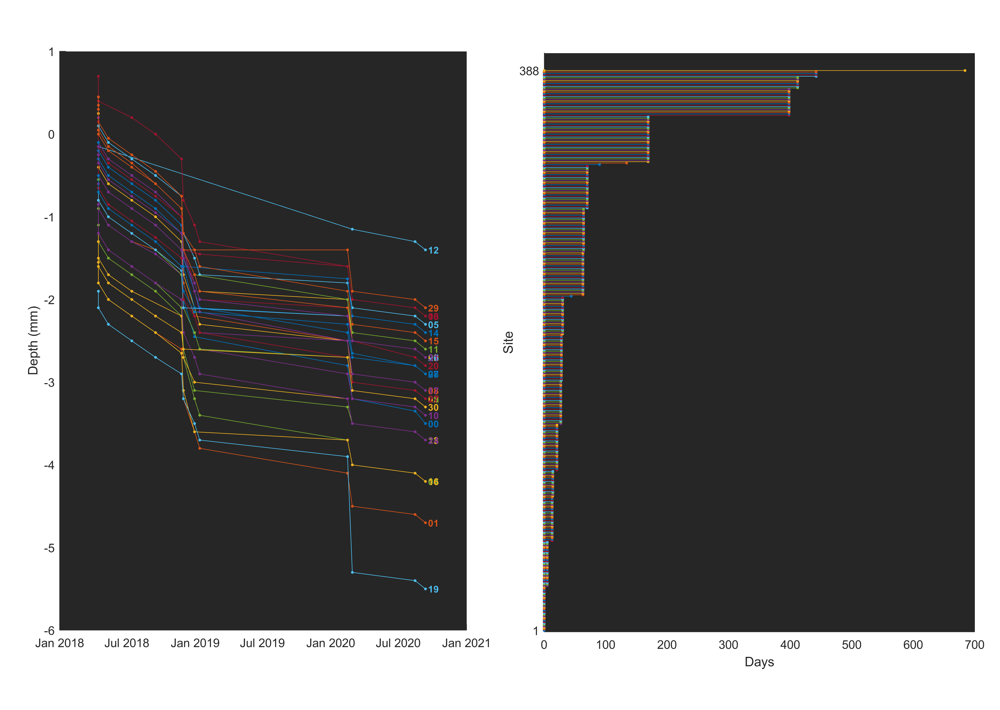

# Electrode positions

## Data
CSV tables for each electrode array in left and/or right hemispheres. Data from:

- **F1613** Ariel (Auditory, Parietal and Prefrontal Cortex - Left only)
- **F1703** Grainger (Auditory Cortex - Bilateral)
- **F1808** Skittles (Auditory Cortex - Bilateral)
 

## Loading and visualization
A starter function is included to load data and compute the duration at each recording site: **draw_depth_vs_date.m**. More recently, the python version of this function allows use of data straight from this repository without needing to download the data to a local machine.

